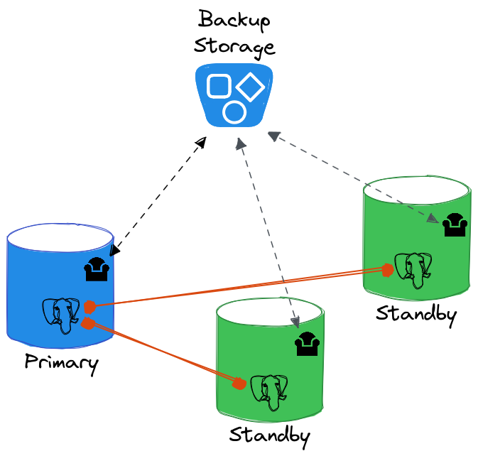
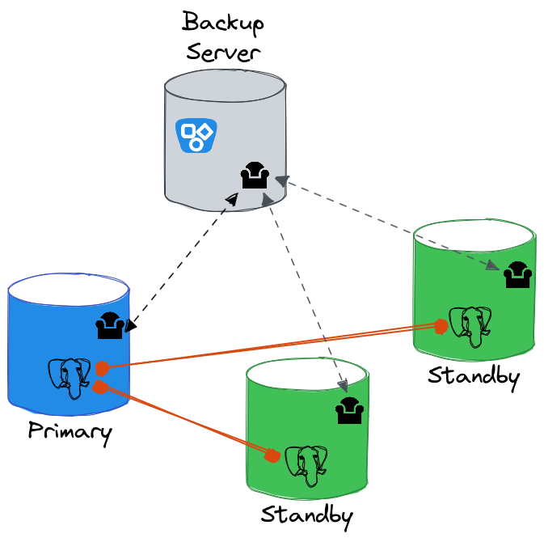

# README

<!--
(\_/)
( •_•)
/ > 🐘
-->

---

## Introduction

This _Test Suite_ uses Ansible to deploy docker containers and typical architectures.

It tends to support the 2 following use-cases.

### Use Case 1 - Directly-attached shared storage



### Use Case 2 - Dedicated repository host



---

## GitHub Actions

[GitHub Actions](../.github/workflows/main.yml) are testing:
  * **Shared storage**: PG 16, Rocky Linux 9, using pgBackRest PGDG packages
  * **Repository host**: PG 16, Ubuntu 22.04, using pgBackRest PGDG packages

---

## Vagrant

To be able to run the tests manually, first initialize the virtual machine with `make init`.

* Deploy Use-Case 1 (shared-storage) and run the activity script: `make ACTIVITY=true uc1`
* Deploy Use-Case 2 (with-repo-host) and run the activity script: `make ACTIVITY=true uc2`

To build pgBackRest from sources, use `uc1_full` or `uc2_full` make targets.

To install pgBackRest and **check_pgbackrest** using PGDG packages, without deploying Icinga2, use `uc1_light` or `uc2_light` make targets.

### Change the test profile

Add `PROFILE=xxx` to the make command.

Available profiles: `d11pg`, `u20pg`, `ro8pg`, `ro9pg`.

### Change the pgBackRest repository type

Add `PGBR_REPO_TYPE=xxx` to the make command.

Available types: `azure`, `s3`, `multi`, `posix`.

When setting `multi` repository, both `s3` and `azure` will be used. When setting `posix` repository, the repository path will be automatically adjusted to `/shared/repo1` where */shared* is a shared volume between the docker containers.

### Icinga2

To interact with Icinga2, the easiest way is to use the API:

```bash
# Login to the vagrant box
$ vagrant ssh

# Reschedule check_pgbackrest checks
$ curl -k -s -u 'icinga2-director:anyPassWord' -H 'Accept: application/json' -X POST \
 'https://localhost:5665/v1/actions/reschedule-check' \
 -d '{ "type": "Service", "filter": "match(pattern,service.name)", "filter_vars": { "pattern": "pgbackrest*" }, "pretty": true }' |jq

# Get check_pgbackrest checks status
$ curl -k -s -u 'icinga2-director:anyPassWord' -H 'Accept: application/json' -X GET \
 'https://localhost:5665/v1/objects/services' \
 -d '{ "filter": "match(pattern,service.name)", "filter_vars": { "pattern": "pgbackrest*" } }' |jq
```

### Cleaning

Before changing the `PROFILE` to deploy a new architecture, remove the docker containers and cluster directory using `make PROFILE=xxx clean_ci`.

To remove the vagrant virtual machine: `make clean_vm`.
